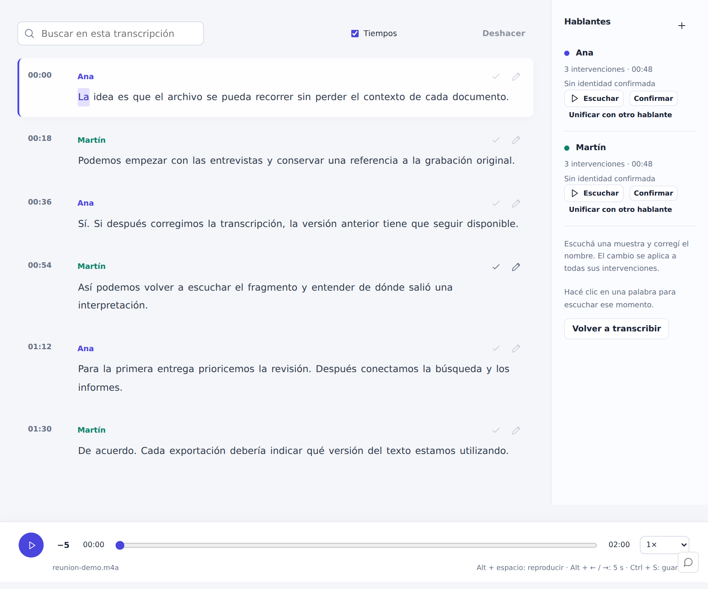
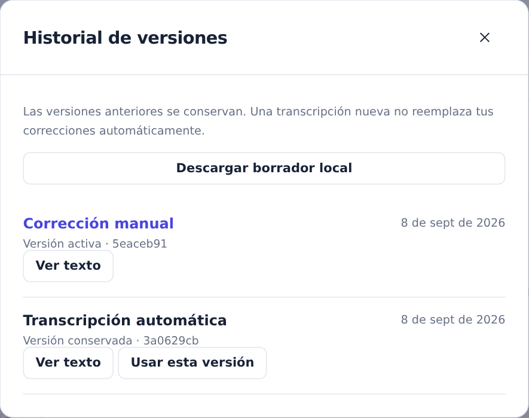

# Transcriber

A recording library with synchronized playback, editable transcripts and version history.

Upload a recording, listen while reading, correct the transcript and keep a history of your changes. Export the result for reading, subtitling or further analysis.

Listen, navigate by timestamp and correct the transcript in one workspace.

## Working with transcripts

- Navigate between words and their corresponding audio.
- Correct text, timing and speaker labels.
- Save revisions and consult earlier versions.
- Reprocess a recording while preserving reviewed work.
- Export Markdown, text, JSON, SRT or VTT.

Automatic transcripts and speaker labels can need correction. Transcriber keeps listening, editing and reviewing in the same workflow.

## Version history

Save a correction and keep earlier versions available to review or restore.

*Screenshots use fictional example data.*
